# Baseline Plan

## Metadata

- **Iteration ID:** baseline
- **Plan confirmed date:** 2026-10-07

---

## 1. Architecture

### 1.1 Domains and application architecture

Single domain — the whole system

The repository is intentionally one domain because product behavior and its bounded self-healing demonstration form one workshop sample and share one release boundary.

| ID | Component | Responsibility |
| --- | --- | --- |
| C-1 | React web client | Accessible anonymous to-do experience and unavailable states |
| C-2 | Versioned HTTP API | OpenAPI-conformant validation, rate limiting, errors, and health |
| C-3 | To-do service | CRUD rules plus the three scenario functions |
| C-4 | Blob repository | Durable optimistic-concurrency persistence through managed identity |
| C-5 | Scenario controller | Manual fixtures, concurrency, cancellation, cleanup, and recursion prevention |
| C-6 | Deterministic control plane | Evidence normalization, classification, policy, redaction, and validation |
| C-7 | Remediation agent | One GitHub Agentic Workflow Copilot proposal using two bounded tool contracts |
| C-8 | Evaluation and telemetry | N equals 3 scoring, reports, trace correlation, token and AI-credit normalization |
| C-9 | Azure platform | Container Apps, ACR, Blob Storage, Log Analytics, identity, and health |

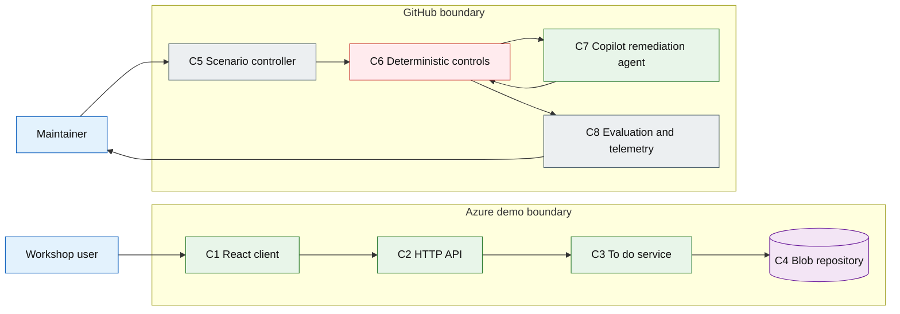

### 1.2 Data architecture

Only public demo to-do content and non-identifying run evidence are permitted. To-dos are stored as one versioned JSON document in Blob Storage and updated with ETag conditional writes. Failed-run artifacts are retained for 30 days; merged or closed temporary branches are deleted.

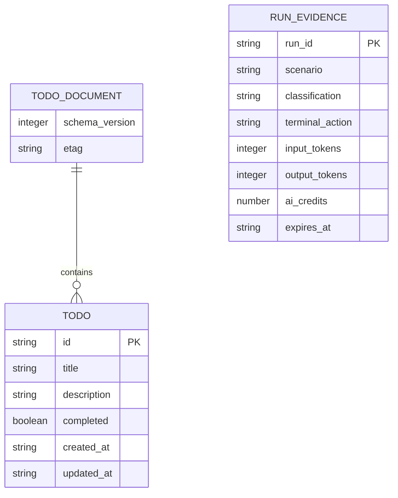

### 1.3 Infrastructure architecture

Azure Container Apps runs one active application replica to preserve simple shared-demo write semantics. A user-assigned managed identity reads and writes one private blob container. GitHub OIDC assumes the same deployment identity without stored cloud credentials. ACR image pull uses managed identity.

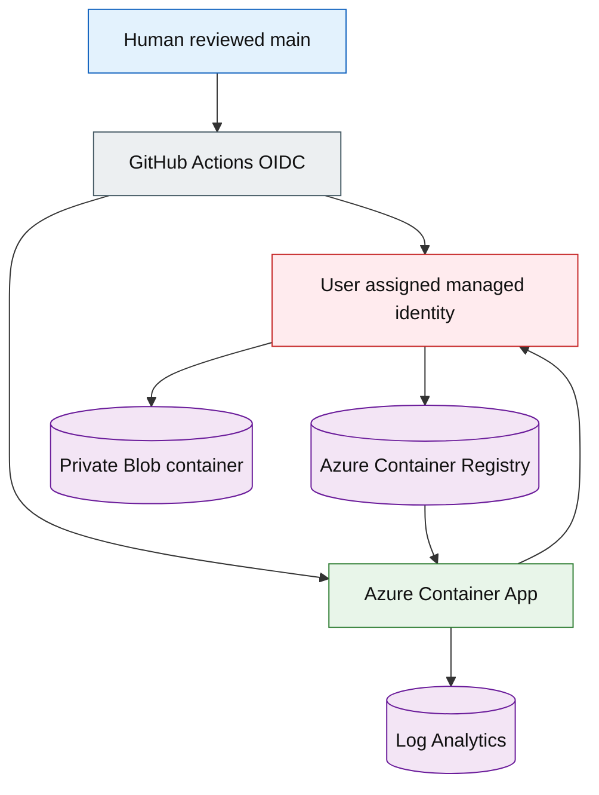

### 1.4 Security architecture

Trust is split among anonymous product access, protected GitHub execution, and Azure workload identity. Product content is untrusted data and never becomes workflow instruction. The agent receives only the normalized bundle and allowlisted files. Policy validates the proposal before it can be applied.

Application-to-Azure authentication uses a user-assigned managed identity and Azure RBAC. GitHub-to-Azure authentication uses a short-lived OIDC federated credential; no PAT, client secret, storage key, or access key is permitted. The one-time identity-bootstrap step first searches for reusable trust, then creates the OIDC trust and runtime identity only after explicit Human User approval.

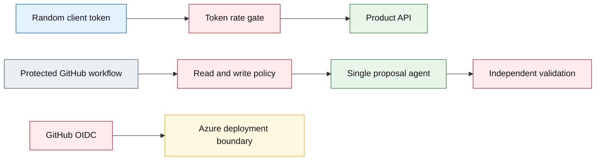

### 1.5 Technology choices

| Concern | Choice | Rationale and contract |
| --- | --- | --- |
| Product language | C++17 | Required by Seed and portable through CMake |
| API framework | Oat++ | Typed C++ HTTP controllers, CMake support, OpenAPI-friendly ecosystem |
| Core data | `nlohmann/json` and Azure Storage Blobs SDK | Versioned JSON document with ETag writes and managed identity |
| Dependency build | vcpkg manifest mode, pinned baseline, ccache, and a pinned CI build image | Reproducible dependencies and cache hits keep scenario runs inside ten minutes |
| Web UI | React, TypeScript, Vite | Delegated UI stack with strong accessibility and test tooling |
| API contract | OpenAPI 3.1 | Contract-first schema and generated validation checks |
| Unit and integration tests | Catch2 and CTest | Native deterministic tests and JUnit export |
| Browser tests | Playwright plus axe-core | CRUD, keyboard, unavailable state, and WCAG evidence |
| Performance | Google Benchmark and k6 | 10,000-item duplicate benchmark plus 20-user API load |
| Coverage | llvm-cov or gcovr | Repository and changed-line thresholds at 80 percent |
| Cloud | Azure Container Apps, ACR, Blob Storage, Log Analytics, Bicep | Managed demo runtime with health, persistence, and IaC |
| CI and release | GitHub Actions with pinned full-length action SHAs | Tests, scans, SBOM, provenance, deployment, and branch protection |
| Agent framework | GitHub Agentic Workflows | Human-selected framework aligned with the sample purpose |
| Agent engine | GitHub Copilot coding agent | One bounded remediation agent |
| Orchestration | Single agent, one proposal, deterministic outer loop | Prevents agent-owned policy and repeated attempts |
| Agent tools | Safe outputs plus `request_context` and `propose_patch` JSON contracts | Bounded read expansion and one structured patch |
| Evaluation | JSONL dataset and repository scorer | DIM-1 N equals 3 K equals 2, DIM-2 100 percent, DIM-3 zero mutations |
| Tracing and cost | `token-usage.jsonl` plus Agentic Workflow audit records normalized to OpenTelemetry-compatible JSON | Per-call input, output, cache tokens, model, provider, and AI credits aggregate to request, run session, and UTC day |
| Skills | Project-pinned Impeccable skill 4.5.0 through wrapper 4.1.0 | Approved UX shaping and deterministic quality scan |

The Human User's preferred agentic framework is GitHub Agentic Workflows with Copilot. The project overrides the inherited Microsoft Agent Framework default. No multi-agent pattern is used.

**Currency:** Choices were checked at PLAN time against current official documentation for Oat++, React and Vite, Azure Container Apps, Azure Blob Storage C++ SDK, Bicep, GitHub Actions, GitHub Agentic Workflows, the Copilot engine, safe outputs, and cost management.

**Human User preferences:** GitHub Agentic Workflows with Copilot coding agent; C++17 product core; Azure demo or sandbox; delegated UI and API technology choices.

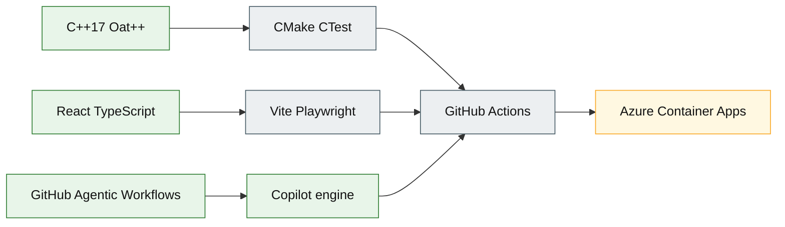

### 1.6 Test architecture

Tests form concentric independent gates. The remediation agent cannot alter the evaluator, policy tests, thresholds, or gate commands in a scenario proposal.

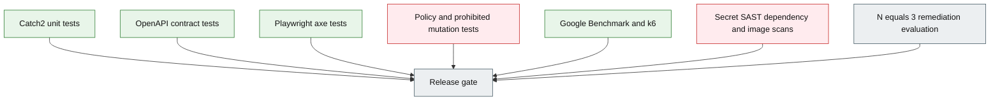

### 1.7 Operations architecture

Application health and workflow health are separate. Azure probes restart unhealthy containers; workflow runs emit correlated evidence and terminate as PR, escalation, cancellation, or infrastructure failure artifact.

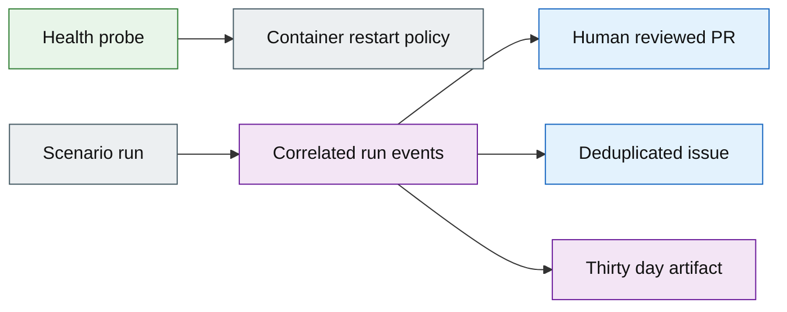

---

## 2. Design

### 2.1 Application design

The product follows controller, service, repository layering. Scenario functions remain pure or dependency-injected so fixtures and remediation validation are deterministic. Workflow code applies fixtures only on temporary branches and never invokes itself from its own commits.

**D-1 — Layered product and bounded workflow design**

**Refines:** C-1, C-2, C-3, C-4, C-5, C-6, C-7, C-8

UC-1 Manage to-do items:

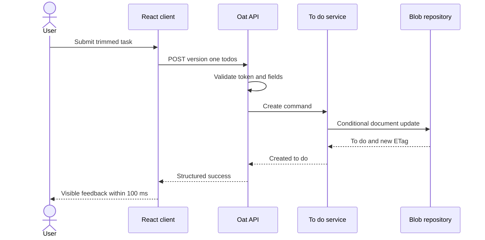

UC-2 Run an independent self-healing scenario:

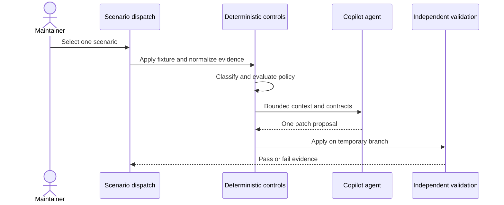

UC-3 Review a successful remediation:

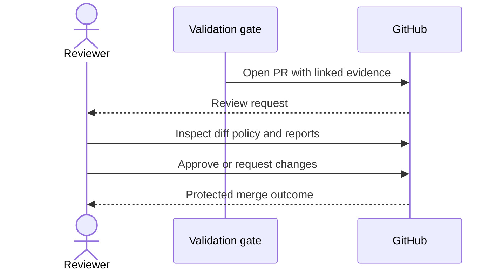

UC-4 Review an escalation:

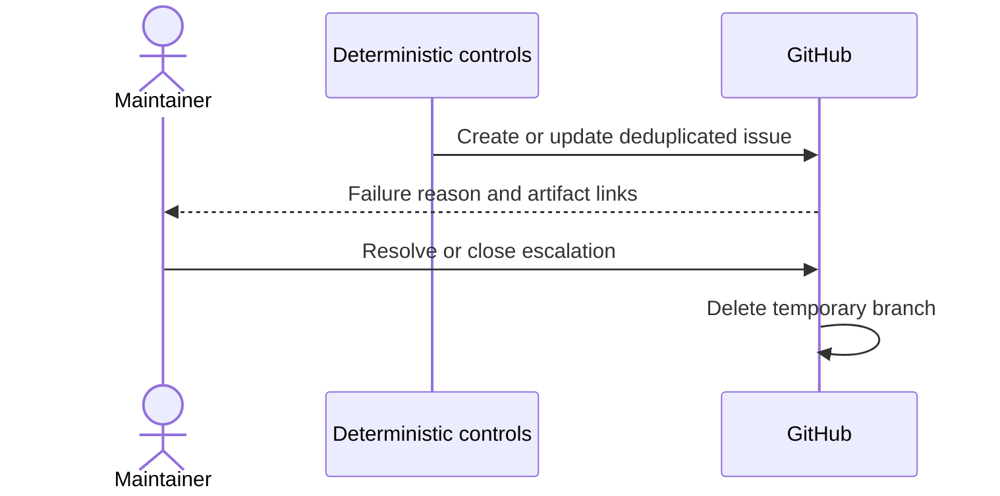

UC-5 Adapt the reference implementation:

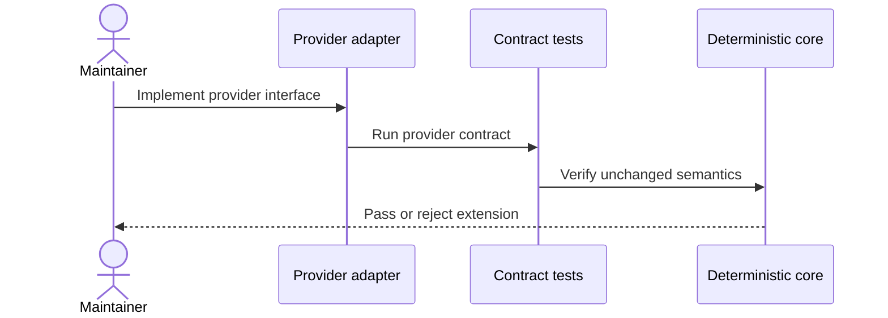

### 2.2 Data design

The persisted document has `schemaVersion`, `items`, and no user identity. IDs are random UUIDs; timestamps are UTC. Reads tolerate no unknown schema version. One active replica and an in-process write mutex serialize demo mutations; ETags still protect restart or external-writer races. Writes retry one ETag conflict with a fresh read, then return structured unavailable evidence.

**D-2 — Versioned public-demo persistence**

**Refines:** C-4, C-8

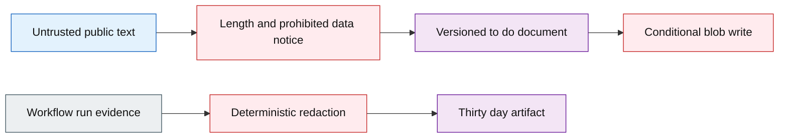

### 2.3 Infrastructure design

Bicep modules separate one-time identity bootstrap from repeatable application infrastructure. `infra/bootstrap` creates or reuses a user-assigned identity, federated credential, and minimum RBAC only after an interactive hard-guardrail approval. `infra/app` consumes identity resource IDs and cannot create credentials.

**D-3 — Identity-first repeatable Azure deployment**

**Refines:** C-9

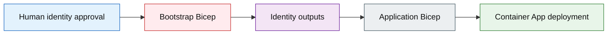

### 2.4 Security design

Policy is data, versioned and tested. It declares readable and writable paths, prohibited mutations, exact validation commands, confidence threshold, and terminal action. Any malformed or missing policy denies remediation.

**D-4 — Fail-closed deterministic authority**

**Refines:** C-2, C-5, C-6, C-7, C-9

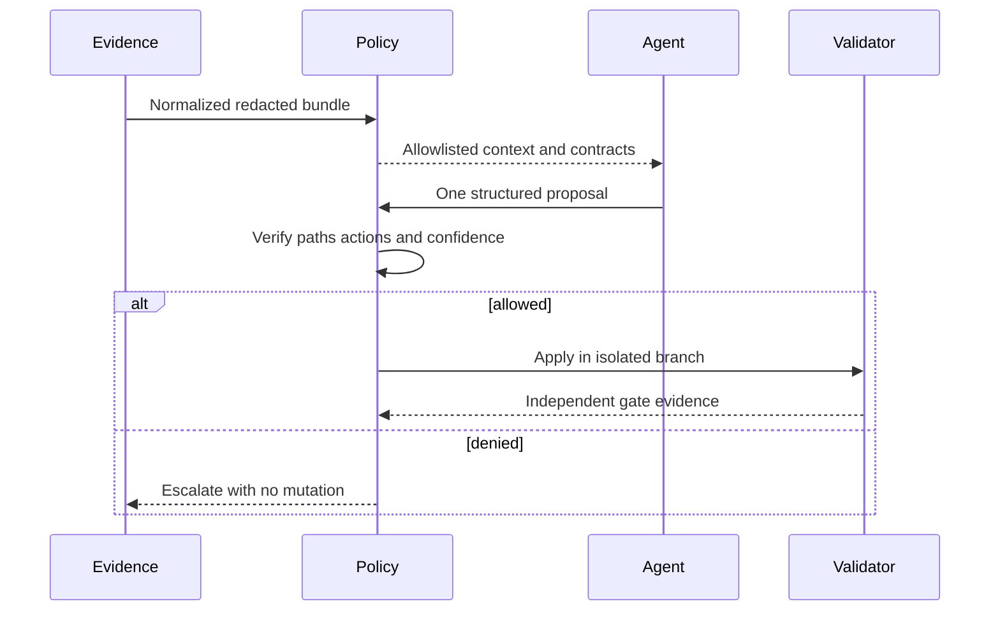

### 2.5 Test design

Every acceptance criterion writes its declared evidence path. Scenario fixtures have positive, unsupported, denied, low-confidence, unavailable-agent, failed-validation, cancellation, duplicate-run, and GitHub-outage cases. Evaluation seeds and prompts are held stable for the three independent gate runs.

Scenario CI runs in a pinned build image with vcpkg artifacts and compiler output restored from cache. Hard stage budgets are checkout and cache 30 seconds, incremental build 90 seconds, classify and policy 30 seconds, agent turn 180 seconds, independent validation including scans 180 seconds, and PR or escalation publication 60 seconds, totaling 570 seconds. A stage timeout fails closed; only the three spec-approved transient operations may retry once.

**D-5 — Independent evidence-producing gates**

**Refines:** §1.6

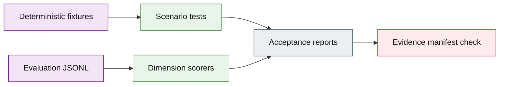

### 2.6 UX design

The approved Quiet Utility direction is defined by `ux/surface-brief.md`, `ux/direction-contract.md`, and responsive renderings under `evidence/`. Impeccable detection passes with zero findings. The UI uses a focused one-column task list, explicit public-demo notice, visible primary action, keyboard controls, live mutation status, and unavailable or empty states.

**D-6 — Quiet Utility to-do surface**

**Refines:** C-1

The mockups were produced through Impeccable's authored init, shape, and new-work process as renderable HTML and CSS. The primary screen has a clean anti-pattern scan. The Human User approved `evidence/quiet-utility-desktop.png` and `evidence/quiet-utility-mobile.png` on 2026-10-07.

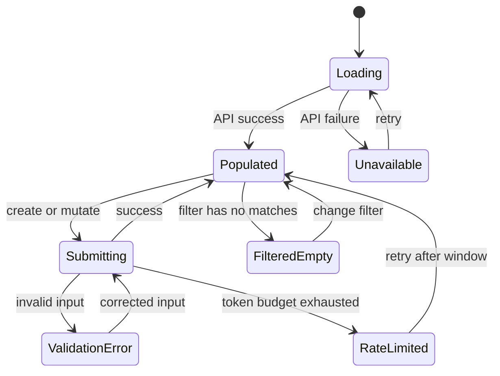

### 2.7 API design

OpenAPI 3.1 is the source of truth under `api/openapi.yaml`. Routes are `/api/v1/todos`, `/api/v1/todos/{id}`, and `/healthz`. Every API request except health carries a random `X-Demo-Client` token generated locally and unrelated to identity, device, network, or source IP.

Errors use `{error:{code,message,fields?,request_id}}` for validation, not found, rate limit, and unavailable responses. A superseded API advertises `Deprecation` and `Sunset` headers and remains available for at least 90 days. Each k6 virtual user receives a distinct random demo token so the 20-user latency test measures product performance rather than the per-token abuse limit.

**D-7 — Contract-first versioned HTTP API**

**Refines:** C-2, C-3

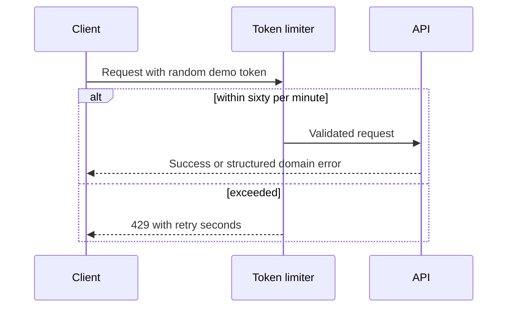

---

## 3. Orchestration

### 3.1 Work breakdown

| ID | Title | Domain | Description | Expected file footprint | Traces to |
| --- | --- | --- | --- | --- | --- |
| W-1-eval | Build evaluation contract first | Whole system | Create dataset, deterministic scorers, three-run harness, policy and mutation dimensions, and report schemas. | `tests/eval/**`, `reports/eval/.gitkeep` | C-8, FR-11, NFR-9, NFR-13, AC-17 |
| W-2 | Establish repository and contracts | Whole system | Add CMake presets, pinned vcpkg manifest, OpenAPI 3.1, shared schemas, formatting, and test entry points. | `CMakeLists.txt`, `CMakePresets.json`, `vcpkg.json`, `vcpkg-configuration.json`, `cmake/**`, `api/**`, `schemas/**` | C-2, C-3, FR-4, FR-17, AC-6, AC-29 |
| W-3-identity-bootstrap | Bootstrap Azure identity | Whole system | Search reusable identities, then with explicit approval provision OIDC federation, managed identity, and minimum RBAC. | `infra/bootstrap/**` | C-9, NFR-8, NFR-10 |
| W-4 | Implement C++ product core | Whole system | Add model, validation, service, scenario functions, repository interface, local test adapter, Oat controllers, health, rate limiting, and Catch2 tests. | `include/core/**`, `include/api/**`, `include/storage/repository.hpp`, `src/core/**`, `src/api/**`, `src/storage/local_repository.cpp`, `tests/unit/**`, `tests/integration/api/**` | C-2, C-3, C-4, FR-1, FR-2, FR-3, FR-4, FR-18, NFR-2, NFR-4, NFR-7, NFR-11, AC-1, AC-2, AC-3, AC-4, AC-5, AC-6, AC-8 |
| W-5 | Implement approved web UI | Whole system | Build the responsive Quiet Utility React surface and browser tests from approved evidence. | `ui/**`, `tests/browser/**` | C-1, FR-1, FR-2, FR-18, NFR-3, NFR-6, AC-1, AC-2, AC-4, AC-7, AC-9, AC-25 |
| W-6 | Build deterministic scenario control plane | Whole system | Implement fixtures, normalization, classifier, redaction, policy, concurrency, cancellation, cleanup, escalation, safety cases, and provider contracts. | `automation/control/**`, `automation/fixtures/**`, `tests/control/**`, `tests/safety/**`, `tests/contracts/**` | C-5, C-6, FR-5, FR-6, FR-7, FR-8, FR-13, FR-14, FR-15, FR-16, FR-17, NFR-1, NFR-9, NFR-10, NFR-12, NFR-15, AC-11, AC-16, AC-18, AC-19, AC-20, AC-22, AC-25, AC-26, AC-28, AC-29 |
| W-7 | Implement one bounded remediation agent | Whole system | Author GitHub Agentic Workflow source and locked output with Copilot engine, safe outputs, context request, and one proposal. | `.github/workflows/remediation.md`, `.github/workflows/remediation.lock.yml`, `automation/tools/**` | C-7, FR-9, FR-10, NFR-9, AC-13, AC-14, AC-15, AC-17, AC-18, AC-19 |
| W-8 | Build independent validation and evidence first | Whole system | Add scenario and shared gate runners, coverage, benchmarks, evidence manifest, token-usage fixture normalizer, and AI-credit aggregation before agent wiring. | `automation/validate/**`, `tests/policy/**`, `benchmarks/**` | C-6, C-8, FR-11, FR-16, NFR-4, NFR-5, NFR-9, NFR-12, NFR-13, AC-8, AC-12, AC-13, AC-14, AC-15, AC-16, AC-17, AC-18, AC-19, AC-21, AC-26, AC-27 |
| W-9 | Provision repeatable Azure application | Whole system | Implement the managed-identity Blob adapter and app Bicep for ACR, Container Apps, Blob, probes, logs, and identity assignments. | `include/storage/azure_blob_repository.hpp`, `src/storage/azure_blob_repository.cpp`, `infra/app/**` | C-4, C-9, FR-3, FR-18, NFR-8, NFR-10, NFR-11, AC-3, AC-23 |
| W-10 | Build CI security and release supply chain | Whole system | Add pinned cached CI, dependency review, SAST, secret and image scans, branch ruleset manifest, SBOM, provenance, deployment, and cleanup workflows. | `.github/workflows/ci.yml`, `.github/workflows/release.yml`, `.github/workflows/deploy.yml`, `.github/dependabot.yml`, `.github/rulesets/**` | C-9, FR-12, FR-15, NFR-5, NFR-8, NFR-9, NFR-14, AC-12, AC-21, AC-23, AC-24, AC-28 |
| W-11 | Complete documentation and usability evidence | Whole system | Add workshop path, extension guide, architecture records, N at least 3 usability script and results, and operator runbook. | `docs/**`, `tests/usability/**` | C-1, FR-17, NFR-6, NFR-15, AC-10, AC-29, AC-30 |
| W-12 | Deploy and run acceptance | Whole system | Build release image, obtain exposure approval if required, deploy sandbox, run all acceptance checks and agent evaluation, and publish evidence index. | `scripts/acceptance/**`, `reports/acceptance/.gitkeep` | C-1, C-2, C-3, C-4, C-5, C-6, C-7, C-8, C-9, AC-1, AC-2, AC-3, AC-4, AC-5, AC-6, AC-7, AC-8, AC-9, AC-10, AC-11, AC-12, AC-13, AC-14, AC-15, AC-16, AC-17, AC-18, AC-19, AC-20, AC-21, AC-22, AC-23, AC-24, AC-25, AC-26, AC-27, AC-28, AC-29, AC-30 |

### 3.2 Sequencing and dependencies

- **W-2 depends on:** none
- **W-1-eval depends on:** W-2
- **W-3-identity-bootstrap depends on:** none, but pauses for the identity-bootstrap hard guardrail
- **W-4 depends on:** W-2
- **W-5 depends on:** W-2, W-4
- **W-6 depends on:** W-1-eval, W-2, W-4
- **W-8 depends on:** W-1-eval, W-4, W-6
- **W-7 depends on:** W-1-eval, W-6, W-8
- **W-9 depends on:** W-3-identity-bootstrap, W-4, W-5
- **W-10 depends on:** W-1-eval, W-5, W-7, W-8, W-9
- **W-11 depends on:** W-5, W-6, W-8
- **W-12 depends on:** W-9, W-10, W-11

The explicit eval-first edge is **W-7 depends on W-1-eval**. W-7 also depends on W-8, so the independent validator exists before the agent is wired. No LLM-driven behavior is implemented before the dataset, scorers, prohibited-mutation checks, and report contract exist. Cloud-provisioning and cloud-authenticating application work cannot begin before W-3-identity-bootstrap completes.

W-8 reads per-call records from the Agentic Workflow `token-usage.jsonl` artifact and AI-credit fields from the audit record. Missing token or credit evidence is a failed cost-evidence gate and produces fail-closed escalation; the system never invents usage estimates.

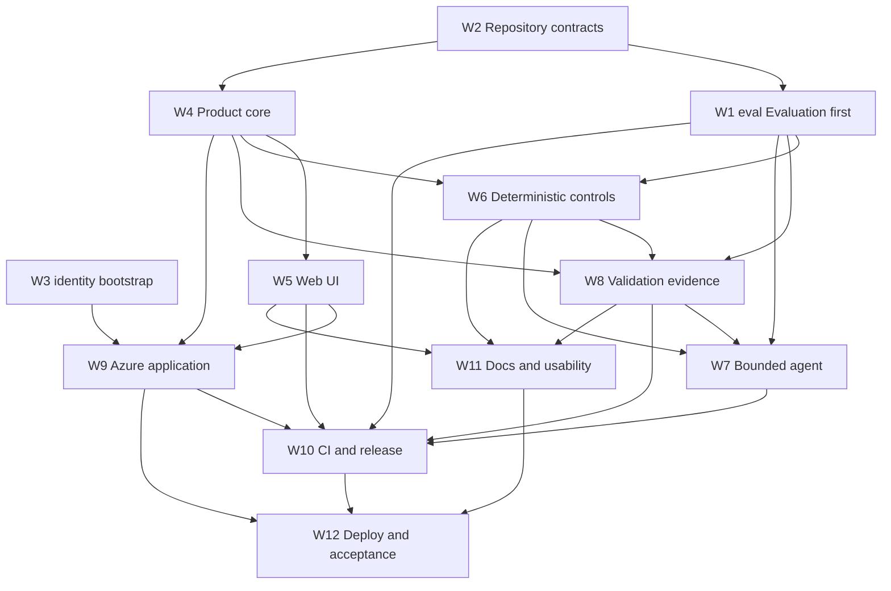

**Execution pattern:** Parallel. After W-2, W-1-eval and W-4 can proceed concurrently; after W-4, UI and deterministic controls can proceed concurrently. W-3 is an independent hard-guardrail lane and gates only cloud-authenticating work. Merge order still follows the DAG and each work item uses its own branch, tests, PR, and branch-scoped replay log.

---

## PLAN-EXIT validation checklist

1. [x] Metadata identifies the baseline and confirmation date.
2. [x] The single domain and all nine components have responsibilities.
3. [x] Architecture covers application, data, infrastructure, security, technology, testing, and operations.
4. [x] Design refines every architecture concern.
5. [x] Product data and run-evidence ownership, retention, and prohibited classes are explicit.
6. [x] Identity bootstrap is separated and precedes cloud-authenticating work.
7. [x] Technology choices include rationale and current project bindings.
8. [x] OpenAPI, UX, accessibility, test, security, and operations designs are explicit.
9. [x] The Human User approved Quiet Utility desktop and mobile renderings.
10. [x] Impeccable deterministic detection reports zero findings.
11. [x] Every FR, NFR, AC, and architecture component maps to at least one work item.
12. [x] Work-item footprints are explicit and non-overlapping.
13. [x] Dependencies are complete and acyclic.
14. [x] Parallel execution is justified from the final DAG.
15. [x] One `W-1-eval` work item precedes all LLM behavior.
16. [x] DIM-1 dataset and scorer, DIM-2 policy scorer, DIM-3 mutation scorer, and report output map to W-1-eval and W-8.
17. [x] The agent proposal, engine, orchestration, tools, evaluation, tracing, guardrails, skills, and Human User preference are recorded.
18. [x] One attempt, human review, fail-closed escalation, cost evidence, and prohibited mutations remain binding.
19. [x] Every non-empty architecture and design subsection has a renderable Mermaid diagram.
20. [x] No required placeholder remains.
