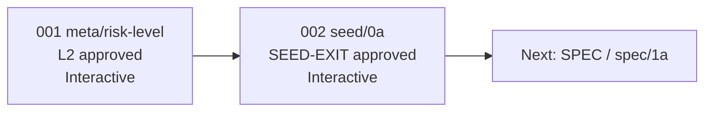

# Baseline Execution Diagram

[Replay-execution log](./execution-log.md)

```mermaid
flowchart LR
    R["001 meta/risk-level<br/>L2 approved<br/>Interactive"]
    S["002 seed/0a<br/>SEED-EXIT approved<br/>Interactive"]
    N["Next: SPEC / spec/1a"]

    R --> S --> N
```
