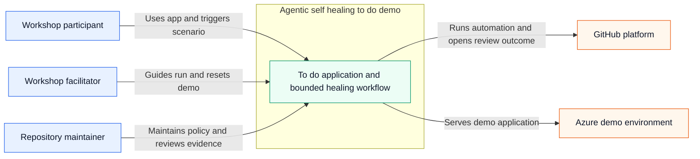

# Technical Specification — Baseline

## Metadata

- **Iteration ID:** baseline
- **Discovery mode:** Interactive
- **Specialization:** sdlc-for-agentic-apps
- **Runtime target:** azure
- **UX mode:** Delegated
- **API mode:** Delegated
- **Spec confirmed date:** 2026-10-07

## 1. Goals

- Deliver a familiar single-domain to-do web application that lets workshop participants create, view, edit, complete or reopen, and delete to-do items.
- Demonstrate three independently triggered self-healing CI scenarios: a unit-test failure, insufficient test coverage, and a performance regression.
- Keep reasoning-heavy automation limited to one bounded remediation attempt while classification, policy enforcement, validation, and outcome handling remain deterministic.
- Produce a human-review-required pull request when remediation succeeds and a deduplicated escalation issue or downloadable escalation artifact when remediation cannot safely complete.
- Provide a reusable reference implementation whose provider extension points can support future engineering toolchains without redesigning the core orchestration.

## 2. Stakeholders

- **Workshop participant or customer engineer:** Uses the to-do application, triggers one demonstration scenario, inspects workflow evidence, and explains the control flow after a guided run.
- **Workshop facilitator:** Prepares the demo environment, guides scenario execution, resets demo data, and explains successful and escalated outcomes.
- **Repository maintainer:** Adapts the template, maintains deterministic policies and fixtures, reviews generated pull requests, and preserves the security and runtime controls.
- **Human reviewer:** Reviews and explicitly approves or rejects every remediation pull request; no workflow may substitute for this authority.
- **Cloud and developer-platform owner:** Maintains the Azure sandbox, GitHub repository controls, short-lived identity federation, and platform availability needed by the demo.

## 3. Success metrics

- **Scenario completion:** During each baseline release validation, 100% of the three scenarios can be triggered and executed independently, with each workflow reaching a terminal outcome in less than 10 minutes.
- **Successful healing:** During baseline acceptance, each supported scenario produces a policy-compliant patch that passes its declared validation and opens a pull request in at least 2 of 3 independent gate-time evaluation runs.
- **Fail-closed handling:** Across the baseline failure-mode test suite, 100% of unsupported, denied, low-confidence, unavailable-agent, and failed-revalidation cases make no prohibited code change and produce exactly one deduplicated escalation outcome.
- **Human authority:** Across static workflow inspection and baseline end-to-end tests, zero paths auto-merge, push directly to `main`, bypass branch protection, or remove the required human review.
- **Application performance:** In the baseline load-test report, API latency is below 500 ms at p95 with 20 concurrent users and zero unexpected 5xx responses.
- **UI responsiveness:** In the baseline browser performance report, every primary user action displays feedback within 100 ms.
- **Coverage:** At baseline acceptance and after Scenario 2 remediation, repository line coverage and changed-line coverage are each at least 80%.
- **Duplicate-search performance:** At baseline acceptance and after Scenario 3 remediation, the median of five runs over 10,000 items is below 250 ms while all correctness tests pass unchanged.
- **Accessibility:** Before baseline closeout, automated and manual checks report zero critical or serious WCAG 2.2 AA violations, and all primary interactions are keyboard operable.
- **Workshop comprehension:** In a baseline usability session with at least three representative participants, every participant completes the primary CRUD journey without facilitator intervention and correctly identifies the six control-flow steps plus the human merge requirement after one guided scenario.

## 4. Constraints

- The application core MUST use C++17 and remain intentionally small enough for workshop participants to understand.
- The product MUST be a single-domain to-do application with a lightweight browser UI and a project-owned, versioned API contract.
- GitHub MUST provide repository hosting, manual scenario dispatch, CI, pull requests, issues, and the agentic remediation integration.
- The Azure target MUST be a demo or sandbox environment and MUST be deployed only through GitHub Actions using short-lived identity federation and workload identity; local or portal deployment is prohibited.
- The workflow MUST use one remediation agent, one diagnosis, one remediation proposal, and one validation per run. Remediation MUST never retry.
- Deterministic infrastructure steps MAY retry once only for checkout, artifact-upload, or network-timeout failures.
- The workflow MUST fail closed when classification is unsupported, policy denies the action, confidence is insufficient, the agent service is unavailable, validation fails, or the required platform outcome cannot be created.
- Remediation MUST start with a normalized failure bundle and relevant files. Additional read-only context MUST require a stated reason and audit record. Secrets remain excluded, and scenario-specific writable paths remain fixed.
- The workflow MUST NOT delete, disable, or skip tests; lower coverage or benchmark thresholds; reduce benchmark data; modify workflow policy to evade a gate; add unsafe concurrency; auto-merge; push to `main`; or override branch protection.
- Shared to-do content MUST be treated as public demo data. The UI MUST prohibit secrets, PII, customer-confidential, regulated, and production data; no external regulatory regime applies to the approved scope.
- Runtime LLM token and estimated cost usage MUST be measured and reported per remediation, session, and day, but the baseline imposes no product-runtime token or currency cap.
- The API contract MUST use OpenAPI 3.1, publish a 90-day deprecation policy, and enforce 60 requests per minute per source IP with structured rate-limit errors.
- The UI MUST meet WCAG 2.2 AA. Security verification MUST use OWASP ASVS and the OWASP API Security Top 10. Release evidence MUST include an SPDX or CycloneDX SBOM and SLSA provenance. Workflow telemetry MUST be OpenTelemetry-compatible.
- Coverity, SonarQube, Synopsys toolchain validation, JFrog, Artifactory, Jira, Azure DevOps, regression farms, EDA validation, and Verdi are extension points only and MUST NOT be implemented in the baseline.

## 5. Domains and use cases

### System context

### Primary user journey

```mermaid
flowchart LR
    subgraph use["Use the sample app"]
        open["Open demo"]
        manage["Manage to do items"]
    end

    subgraph trigger["Trigger one scenario"]
        select["Select fixture"]
        start["Start manual run"]
    end

    subgraph observe["Observe bounded healing"]
        classify["Inspect classification"]
        policy["Inspect policy decision"]
        remediate["Observe one remediation attempt"]
        validate["Inspect validation"]
    end

    subgraph review["Review outcome"]
        outcome{"Outcome"}
        pullRequest["Review pull request"]
        escalation["Review escalation evidence"]
    end

    open --> manage --> select --> start --> classify --> policy --> remediate --> validate --> outcome
    outcome -->|"Validation passes"| pullRequest
    outcome -->|"Cannot heal safely"| escalation

    classDef participant fill:#e8f1ff,stroke:#2563eb,color:#0f172a
    classDef automation fill:#ecfdf5,stroke:#059669,color:#0f172a
    classDef decision fill:#fef3c7,stroke:#d97706,color:#0f172a
    class open,manage,select,start,pullRequest,escalation participant
    class classify,policy,remediate,validate automation
    class outcome decision
```

### 5.1 Domains

Single domain — the whole system.

### 5.2 UC-1: Manage to-do items

- **Actors:** Workshop participant, workshop facilitator.
- **Triggers:** An actor opens the available demo application.
- **Main flow:**
  1. The system displays existing to-do items and the public-demo-data warning.
  2. The actor creates a to-do with a valid title and optional description.
  3. The actor edits the title or description.
  4. The actor marks the item complete and may reopen it.
  5. The actor deletes the item when it is no longer needed.
  6. The system preserves remaining items across browser and application restarts.
- **Exceptions:** Invalid input produces field-level errors; a missing item produces a structured not-found response and refreshes the list; rate-limited requests produce a structured rate-limit response; an unavailable service displays an explicit unavailable state.
- **Dependencies:** Available Azure demo environment, persisted public demo data, project-owned API.

### 5.3 UC-2: Run an independent self-healing scenario

- **Actors:** Workshop participant, workshop facilitator.
- **Triggers:** An actor manually selects the unit-test, coverage, or performance scenario.
- **Main flow:**
  1. The system confirms no run of the selected scenario is active.
  2. The system creates a temporary scenario branch and applies the known fixture.
  3. Deterministic CI produces a normalized failure bundle.
  4. The classifier assigns unit-test, coverage, performance, or unsupported.
  5. The policy gate fixes allowed actions, writable paths, and validation commands.
  6. The remediation agent receives the approved context and performs at most one remediation attempt.
  7. Deterministic validation evaluates the scenario-specific and shared gates.
  8. The system produces either a pull request requiring human review or a fail-closed escalation outcome.
- **Exceptions:** A second run of the same scenario is rejected with a link to the active run; cancellation preserves available evidence without escalation; transient checkout, upload, or network failures retry once; unsupported, denied, low-confidence, unavailable-agent, or failed-validation outcomes stop without a pull request.
- **Dependencies:** GitHub manual dispatch, deterministic fixtures, classifier, policy engine, remediation service, validation suite, pull-request and issue capabilities.

### 5.4 UC-3: Review a successful remediation

- **Actors:** Human reviewer, repository maintainer, workshop participant.
- **Triggers:** Scenario validation passes after the single remediation attempt.
- **Main flow:**
  1. The workflow confirms the patch changed only scenario-approved paths and actions.
  2. The workflow opens a pull request containing the patch and links the failure, policy, and validation evidence.
  3. The reviewer inspects the diff and evidence.
  4. The reviewer approves or rejects the pull request.
  5. Only an approved pull request may be merged through protected-branch controls.
  6. The temporary branch is deleted after the pull request is merged.
- **Exceptions:** Failure to create the pull request retries once, then fails closed and uploads a downloadable escalation artifact; rejection leaves the default branch unchanged.
- **Dependencies:** Passing validation, GitHub pull requests, branch protection, authenticated human review.

### 5.5 UC-4: Review an escalation

- **Actors:** Workshop facilitator, repository maintainer.
- **Triggers:** The scenario is unsupported or cannot complete safely.
- **Main flow:**
  1. The workflow makes no further code change.
  2. The workflow builds a redacted escalation bundle containing classification, policy, agent, and validation evidence available for the run.
  3. The workflow creates or updates one deduplicated GitHub issue for the failure fingerprint.
  4. The actor reviews the issue and linked run artifacts.
  5. The actor closes the issue after manual resolution or confirms no action is required.
  6. The temporary branch is deleted after the escalation is closed; failed-run artifacts remain available for 30 days.
- **Exceptions:** If GitHub issue creation still fails after one retry, the run fails closed and retains a downloadable escalation artifact for manual action.
- **Dependencies:** Failure fingerprinting, redaction, GitHub Issues, workflow artifact retention.

### 5.6 UC-5: Adapt the reference implementation

- **Actors:** Repository maintainer.
- **Triggers:** A maintainer adds a future provider behind an extension point or changes a supported demo component.
- **Main flow:**
  1. The maintainer identifies the applicable provider interface and contract tests.
  2. The maintainer implements the new adapter without changing core classification, policy, remediation-attempt, or validation semantics.
  3. The maintainer runs unit, integration, policy, security, and contract tests.
  4. The maintainer documents the adapter and opens a human-reviewed pull request.
- **Exceptions:** An adapter that cannot satisfy the existing interface, safety controls, or runtime budget is rejected and requires a separately approved scope change.
- **Dependencies:** Stable extension interfaces, contract tests, documentation, protected pull-request workflow.
